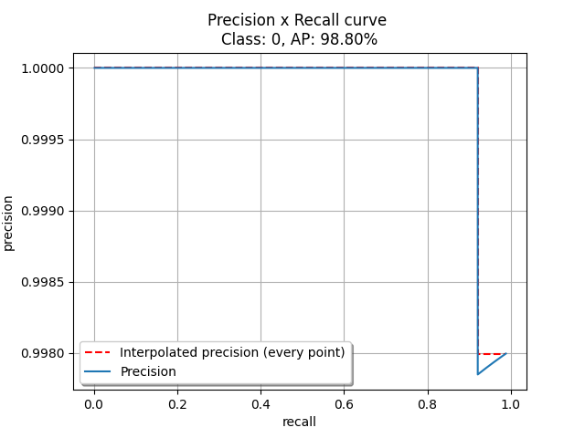

# custom_object_detection

Nella cartella pictures_with_detections trovi tutte le immagini con le relative bounding box predette, mentre nella cartella detected ci sono i file .txt delle previsioni nel formato 
  <classe> <confidenza> <left> <right> <width> <height>
  
Per quanto riguarda il training, come ti dicevo, ho sfruttato le risorse messe a disposizione da Google. La rete è stata addestrata sulle immagini che mi hai fornito, ma solo parzialmente, quella che ho utilizzato ha completato circa 1300 epoche su 6000 totali.
Mi sono basato sul github https://github.com/AlexeyAB/darknet per l'addestramento della rete, ho caricato il file di configurazione .cfg nella cartella train in questo repository. Per quanto riguarda l'inizializzazione dei pesi, ho trovato un file associato ad un tutorial e l'ho sfruttato.
  
Per quanto riguarda la detection, trovi il file YOLONN.py nella cartella detection_validation. Lo script valuta tutte le immagini, calcola le previsioni e salva i file .txt contenenti le previsioni nel formato riportato sopra, oltre che visualizzare le immagini con le relative bounding box e salvarle come .jpg (pictures_with_detections).
  
Infine, per la parte di validazione, ho scaricato i file che mi servivano dal github che mi hai suggerito nella mail, perchè negli esempi mostravano solo utilizzi con le annotazioni in formato json, allora ho sfruttato il codice riportato nel sample2, adattandolo leggermente al mio ambiente di lavoro.
L'average precision 0.99 l'ho ottenuta con una soglia IOU pari a 0.3, di seguito ti riporto il grafico precision x recall con una soglia IOU 0.5.

